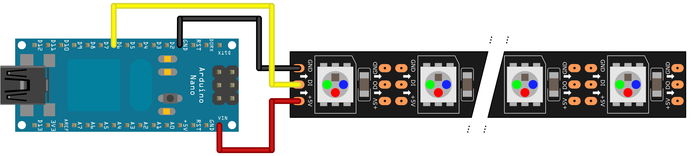

# LED-Tower-Demos

Colorful Pixel Animations for a WS2812B-LED Strip, mostly gathered from the internetz and modified slightly to work together seamlessly

## Requirements

* FastLED 3.1 or later
* Arduino or compatible board
* WS2812B-LED strip (or other FastLED-compatible strip) with 106 LEDs (for [this](https://wiki.chaospott.de/LED_Tower) LED-Tower)

## Wiring

The data output is currently set to pin 6 (as shown in the picture),
but can be configured at the top of the source file via
`< #define DATA_PIN X>`
